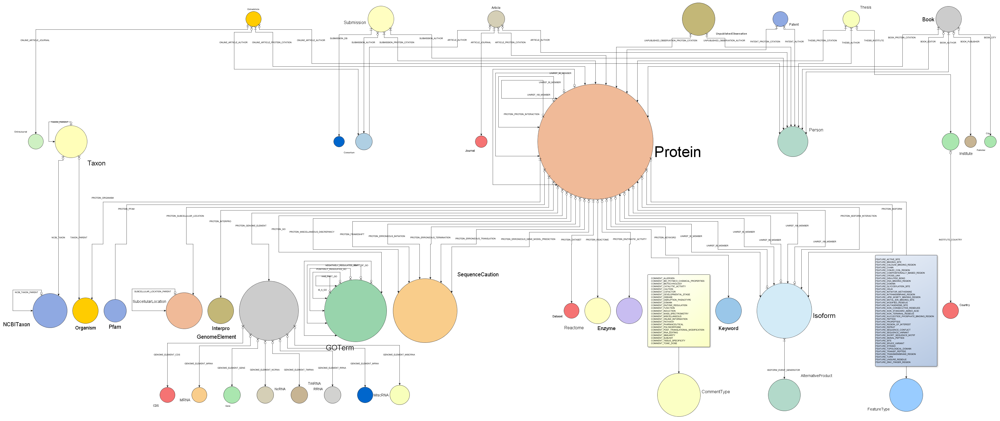
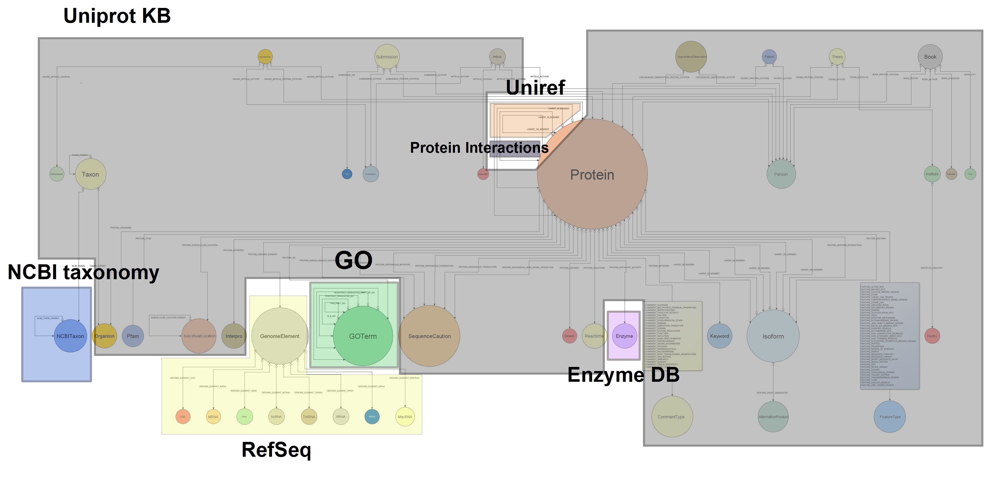

% Bio4j: bigger, faster, leaner
% Pablo Pareja-Tobes, Alexey Alekhin, Evdokim Kovach, Marina Manrique, Eduardo Pareja, Raquel Tobes and Eduardo Pareja-Tobes
% April 8, [IWBBIO-2014](http://iwbbio.ugr.es/)

# Introduction

----

### What is Bio4j?

**Bio4j** is a bioinformatics _graph_-based data platform  
**integrating** the most representative **open data sources**  
around **protein information**

----

### Data sources
 
+------------------------------------------------------------+------------------------------------------------------------------------------+
|                                                            |                                                                              |
+============================================================+==============================================================================+
|                                                            | * *[UniProt KB](http://www.uniprot.org/help/uniprotkb)* (SwissProt + Trembl) |
|                                                            | * *[Gene Ontology](http://www.geneontology.org/)* (GO)                       |
|  | * *[UniRef](http://www.uniprot.org/help/uniref)* (50,90,100)                 |
|                                                            | * *[RefSeq](http://www.ncbi.nlm.nih.gov/RefSeq/)*                            |
|                                                            | * *[NCBI Taxonomy](http://www.ncbi.nlm.nih.gov/Taxonomy/)*                   |
|                                                            | * *[Expasy Enzyme DB](http://enzyme.expasy.org/)*                            |
+------------------------------------------------------------+------------------------------------------------------------------------------+

----

### It's open!

* Code is under the [**AGPLv3**](https://www.gnu.org/licenses/agpl-3.0.html) license
* Only [**Open Data**](http://okfn.org/opendata/) is integrated
* Implementation & release process is  
  [**100% public**](https://github.com/bio4j/bio4j) and totally transparent

----

### Biology & Databases today

* Highly **interconnected overlapping** knowledge 
* spread over **different data sources**
* maintained in the **Relational Databases**  
  or sometimes even just as plain **CSV files**

\ 

That might be fine for simple scenarios  
but as the **amount** and **diversity** of data grows,  
**domain models** become _crazily complicated!_

----

_Doesn't look very compelling right?_
 
<aside class="notes">
    This is the real schema diagram of the GO database
</aside>

----

### Relational model

With relational paradigm the double implication

**Entity** $\Longleftrightarrow$ **Table**

doesn't go both ways, which implies

* **auxiliary tables**
* **artificial IDs**
* dealing with **raw tables** \
  (in spite of entity-relationship diagrams)

\

**Integrating** new knowledge becomes **difficult**

----

### Biology $\neq$ Table

> * **Life** in general and **biology** in particular  
    are probably not 100% like a graph...
> * but one thing is sure: they _**are not a set of tables!**_

----

### Why graph databases?

* Data is stored in a way that **semantically represents its own structure**
* Incorporating new data is easy $\Rightarrow$ it's **scalable**
* **Vertex-centric** _(local)_ indices allow to overcome the supernode problem

----

### Why in the cloud?

#### Data as a service 

* Services interoperability
* Data distribution
* Backup and storage
* Scalability
* Cost-effectiveness

----

## Bio4j

### **=**

### Bio Data 

### **+** 

### Graph Databases 

### **+** 

### The Cloud

# Details about Bio4j

----

### How it all started 

* Need for **massive access** to _Gene Ontology_ annotations
* [**BG7**](http://bg7.ohnosequences.com/) bacterial genome annotation system 
* Need for massive direct access to **protein information**

\ 

### More and more data!

* As _other_ data sources were becoming a _bottleneck_ they were integrated into Bio4j
* First it was Uniprot KB, then Uniref, ... 
* And **we didn't stop yet!**

----

### Different layers of Bio4j

1. Abstract **domain model** with precise typing
2. Universal **[Blueprints](https://github.com/tinkerpop/blueprints/)** implementation
3. **Technology-specific** versions:
    * **[Neo4j](https://github.com/neo4j/neo4j)** 
    * **[Titan](https://github.com/thinkaurelius/titan/)** (WIP)
    * **[OrientDB](https://github.com/orientechnologies/orientdb/)** (planned)

\ 

_Different_ **graph topologies** at the storage level,  
_same_ **domain model** in the client's code

<aside class="notes">
    This way we’re going one step further for making the domain model **independent** from the choice of _database technology_
        - Neo4j with _labels_ 
        - Titan with _type nodes_
</aside>

----

### Bio4j domain model

* $10^9$ edges of **$150$ types**
* $2 \times 10^8$ nodes of **$40$ types**
* $6 \times 10^8$ properties

<!-- exact numbers:
* **`1,216,993,547`** relationships
* `190,625,351` nodes
* `584,436,429` properties
* `144` relationship types
* `42` node types
-->

<aside class="notes">
    Bio4j database has a **well-defined** domain model and all nodes and relationships comply with this abstract model
</aside>

----

### Bio4j structure

The importing process is **modular** and **customizable**  
allowing you to import just the data you are interested in

----

### Bio4j module system

[Statika](http://ohnosequences.com/statika) helps to manage dependencies between modules and simplifies import and deployment in the cloud 

<aside class="notes">
    Just keep in mind that you must be **coherent**
    _e.g. you cannot import protein interactions if you didn't import any protein yet!_
</aside>

# Under the hood

----

### How we use Bio4j in Era7

* **BG7** genome annotation
* **MG7** metagenomics analysis
* Comparative genomics, network analysis,  
  genome assembly, ...

----

### How others use Bio4j

\ 

#### Ohio State University

* **Integration** and **analysis** of Chip-seq data
* **Modeling** genomic information and **gene regulatory networks**

\ 

#### Berkeley Phylogenomics Group

* Graph database for _Big Data challenges_ in **genomics** developed **on top of Bio4j**

----

### How we develop Bio4j

- Java + Scala source code
- **[Statika](http://ohnosequences/statika)**-based module system
- **[SBT](https://github.com/sbt/sbt)** for building sources  
  and automated tests & release
- **[Git + Github](https://github.com/bio4j)**: versioning, docs,  
  collaboration, coordination

----

### Who's doing Bio4j

[Ohnosequences!](http://ohnosequences.com)  
[Era7 bioinformatics](http://era7bioinformatics.com) R&D group

|                                                                   |                                 |
| ----------------------------------------------------------------: | :------------------------------ |
|              [**Pablo Pareja**](http://ohnosequences.com/ppareja) | project leader & main developer |
| [**Eduardo Pareja-Tobes**](http://ohnosequences.com/eparejatobes) | technology & architecture       |
|               [**Raquel Tobes**](http://ohnosequences.com/rtobes) | bio data integration            |
|         [**Marina Manrique**](http://ohnosequences.com/mmanrique) | bio data integration            |
|           [**Alexey Alekhin**](http://ohnosequences.com/aalekhin) | module system developer         |
|            [**Evdokim Kovach**](http://ohnosequences.com/ekovach) | developer                       |

----

### Contacts

* [\@bio4j](http://twitter.com/bio4j) **Twitter** for news
* [bio4j](https://github.com/bio4j) **Github** org for the development process
* [bio4j-user](http://groups.google.com/group/bio4j-user) **Google group** for the user feedback
* [bio4j](http://www.linkedin.com/groups/Bio4j-3890937) **Linkedin** <!-- what is linkedin group for? -->

 

### **[bio4j.com](http://bio4j.com)**

----

### Thank you for attention!

   

_The source and the latest version of these slides can be found at_  
[**`github.com/ohnosequences/IWBBIO-2014`**](https://github.com/ohnosequences/IWBBIO-2014)
