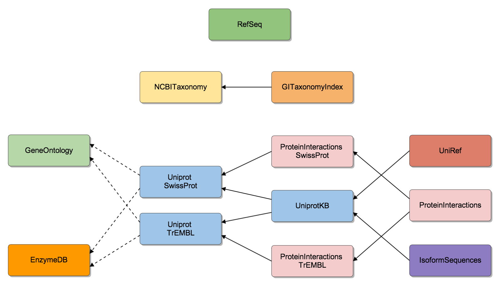
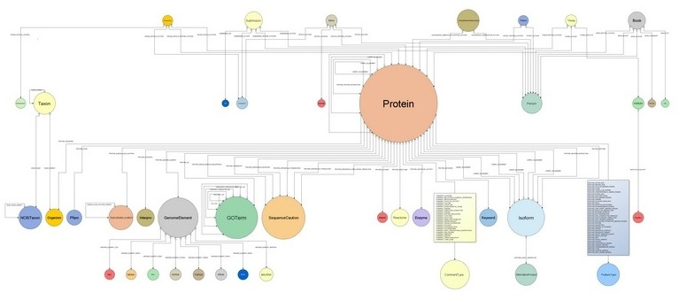

% Bio4j: bigger, faster, leaner
% Pablo Pareja-Tobes, Alexey Alekhin, Evdokim Kovach, Marina Manrique, Eduardo Pareja, Raquel Tobes and Eduardo Pareja-Tobes
% 08.04.2014

# Introduction

----

### What is Bio4j?

**Bio4j** is a bioinformatics _graph_-based data platform  
**integrating** the most representative **open data sources**  
around **protein information**

----

### Data sources
 
<!-- TODO: check if this picture makes sense here -->

+------------------------------------------------------------+------------------------------------------------------------------------------+
|                                                            |                                                                              |
+============================================================+==============================================================================+
|                                                            | * *[UniProt KB](http://www.uniprot.org/help/uniprotkb)* (SwissProt + Trembl) |
|                                                            | * *[Gene Ontology](http://www.geneontology.org/)* (GO)                       |
|  | * *[UniRef](http://www.uniprot.org/help/uniref)* (50,90,100)                 |
|                                                            | * *[RefSeq](http://www.ncbi.nlm.nih.gov/RefSeq/)*                            |
|                                                            | * *[NCBI taxonomy](http://www.ncbi.nlm.nih.gov/Taxonomy/)*                   |
|                                                            | * *[Expasy Enzyme DB](http://enzyme.expasy.org/)*                            |
+------------------------------------------------------------+------------------------------------------------------------------------------+

<!-- 

* *[UniProt KB](http://www.uniprot.org/help/uniprotkb)* (SwissProt + Trembl)
* *[Gene Ontology](http://www.geneontology.org/)* (GO)
* *[UniRef](http://www.uniprot.org/help/uniref)* (50,90,100)
* *[RefSeq](http://www.ncbi.nlm.nih.gov/RefSeq/)*
* *[NCBI taxonomy](http://www.ncbi.nlm.nih.gov/Taxonomy/)*
* *[Expasy Enzyme DB](http://enzyme.expasy.org/)*
-->

----

### It's open!

- Code is under the [**AGPLv3**](https://www.gnu.org/licenses/agpl-3.0.html) license
- Only [**Open Data**](http://okfn.org/opendata/) is integrated
- Implementation & release process is  
  [**100% public**](https://github.com/bio4j/bio4j) and totally **transparent**

----

### Biology & Databases today

* Highly **interconnected overlapping** knowledge 
* spread over **different data sources**
* mantained in the **Relational Databases**  
  or sometimes even just as plain **CSV files**

\ 

That might be fine for simple scenarios  
but as the **amount** and **diversity** of data grows,  
**domain models** become _crazily complicated!_

----

_Doesn't look very compelling right?_

 
----

### Relational model

With relational paradigm the double implication

**Entity** $\Longleftrightarrow$ **Table**

doesn't go both ways, which implies

* **auxiliary tables**
* **artificial IDs**
* dealing with **raw tables** \
  (in spite of entity-relationship diagrams)

\

**Integrating** new knowledge becomes **difficult**

----

### Biology $\neq$ Table

> * **Life** in general and **biology** in particular  
    are probably not 100% like a graph...
> * but one thing is sure: they _**are not a set of tables!**_

----

### Why graph databases?

* Data is stored in a way that **semantically represents its own structure**
* Incorporating new data is easy $\Rightarrow$ it's **scalable**
* **Vertex-centric** _(local)_ indices allow to overcome the supernode problem

----

### Why Bio4j?

Bio Data **+** Graph Databases **+** The Cloud

# Details about Bio4j

----

<!-- I'm not sure if I should talk about this: -->
### How it all started 

* Need for **massive access** to _Gene Ontology_ annotations
* [**BG7**](http://bg7.ohnosequences.com/) bacterial genome annotation system 
* Need for massive direct access to **protein information**

----

### More and more data!

* As _other_ data sources were becoming a _bottleneck_ they were being added to Bio4j
* First it was Uniprot KB, then Uniref and **we didn't stop yet**

\ 

Some numbers:

* $10^9$ edges of $150$ types
* $2 \times 10^8$ nodes of $40$ types
* $6 \times 10^8$ properties

<!-- * **`1,216,993,547`** relationships
* `190,625,351` nodes
* `584,436,429` properties
* `144` relationship types
* `42` node types
-->

----

### Bio4j structure

Bio4j importing process is **modular** and **customizable** allowing you to import just the data you are interested in

<!-- Just keep in mind that you must be **coherent**
_e.g. you cannot import protein interactions if you didn't import any protein yet!_ -->

----

### Different layers of Bio4j

1. Abstract **domain model** with precise typing
2. Universal **[Blueprints](https://github.com/tinkerpop/blueprints/)** implementation
3. **Technology-specific** versions (optimizations, features):
    * **[Neo4j](https://github.com/neo4j/neo4j)** 
    * **[Titan](https://github.com/thinkaurelius/titan/)** (WIP)
    * **[OrientDB](https://github.com/orientechnologies/orientdb/)** (planned)

\ 

_Different_ **graph topologies** at the storage level,  
_same_ **domain model** in the client's code

<!-- This way we’re going one step further for making the domain model **independent** from the choice of _database technology_ -->
<!-- - Neo4j with _labels_ - Titan with _type nodes_ -->

----

### Domain model

Bio4j database has a **well-defined** domain model and all nodes and relationships comply with this abstract model

----

<!-- Not sure if I should talk about this: (may be too technical and I don't know much) -->
<!-- 
### Why Neo4j

* Wide **adoption**
* Stable
* **Cypher**

### Why Titan

* **Local!** indexes
* **On-disk** access
* **Type** definitions $\rightarrow$ _constraints!_
-->

### Bio4j and the cloud

#### Data as a service

* Interoperability and data distribution
* Backup and storage
* Scalability
* Cost-effectiveness

# Under the hood

----

### How we use Bio4j in Era7

* **[BG7](http://bg7.ohnosequences.com)** genome annotation
* **MG7** metagenomics analysis
* Comparative genomics, network analysis, genome assembly, ...

<!-- What is comparative genomics? -->

<!-- Don't know anything about this: -->
<!-- 
### Use cases

**Ohio State University**

* **Integration** and **analysis** of Chip-seq data
* **Modeling** genomic information and **gene regulatory networks**

**Berkeley Phylogenomics Group**

* Graph database for _Big Data challenges_ in **genomics** developed **on top of Bio4j**
-->

----

### How we develop Bio4j?

- **[Statika](http://ohnosequences/statika)** cloud, data + code, modules (see [next talk](https://fosdem.org/2014/schedule/event/graphdevroom_bio4j_1/))
- **[sbt](https://github.com/sbt/sbt)** build Java + Scala, automated Bio4j-specific test & release
- **[git + github](https://github.com/bio4j)** versioning, docs, collaboration, coordination

### dev and release process

* coordinate **data** and **code**
* **[Semantic Versioning](http://semver.org/spec/v2.0.0.html)**
* **Cloud** integration, distribution, deployment, ...

----

### Who's doing Bio4j?

[Ohnosequences!](http://ohnosequences.com)  
[Era7 bioinformatics](http://era7bioinformatics.com) R&D group

|                                                                   |     |                                 |
| ----------------------------------------------------------------: | :-: | :------------------------------ |
|              [**Pablo Pareja**](http://ohnosequences.com/ppareja) |  —  | project leader & main developer |
| [**Eduardo Pareja-Tobes**](http://ohnosequences.com/eparejatobes) |  —  | technology & architecture       |
|               [**Raquel Tobes**](http://ohnosequences.com/rtobes) |  —  | bio data integration            |
|         [**Marina Manrique**](http://ohnosequences.com/mmanrique) |  —  | bio data integration            |
|           [**Alexey Alekhin**](http://ohnosequences.com/aalekhin) |  —  | module system developer         |
|            [**Evdokim Kovach**](http://ohnosequences.com/ekovach) |  —  | developer                       |

----

### Contacts

* [\@bio4j](http://twitter.com/bio4j) **Twitter** for news
* [bio4j](https://github.com/bio4j) **Github** org for the developement process
* [bio4j-user](http://groups.google.com/group/bio4j-user) **Google group** for the user feedback
* [bio4j](http://www.linkedin.com/groups/Bio4j-3890937) **Linkedin**

<!-- what is linkedin group for? -->

----

### Thank you for attention!
